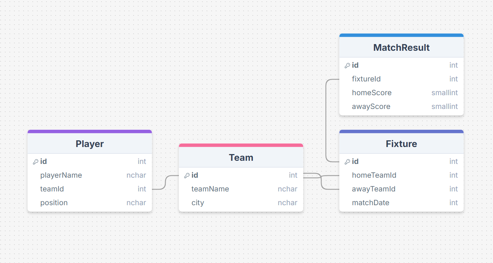
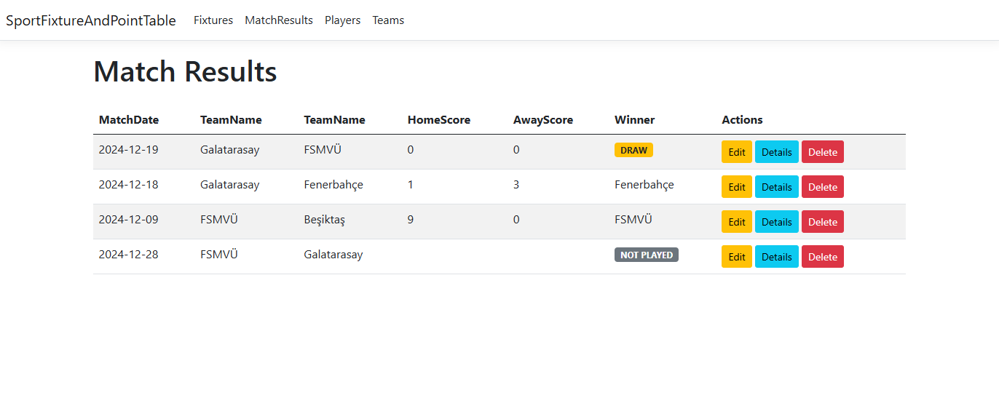
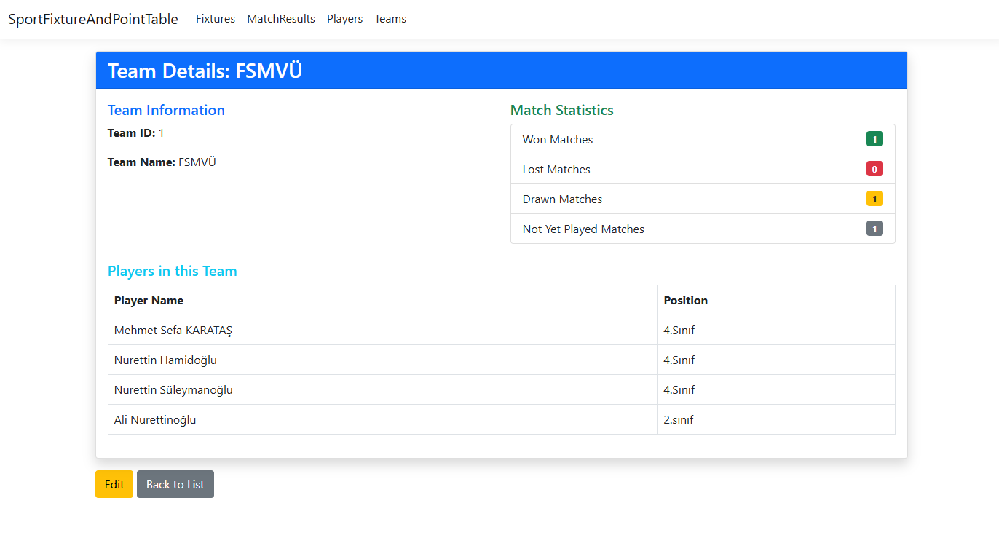

# Sport Fixture and Point Table

## Description
The **Sport Fixture and Point Table** project is an ASP.NET Core MVC application designed to manage sports teams, players, match fixtures, and results. This project demonstrates fundamental backend and frontend development concepts, providing CRUD operations, dynamic data visualization, and database integration using SQL Server.

The project was built as a midterm homework assignment for BLM19417E Web Design and Programming. It showcases the use of MVC architecture, Razor Views, Bootstrap for styling, and SQL Server for database management.

---

## Features
- **CRUD Operations**:
  - Manage Teams, Players, Fixtures, and Match Results.
- **Dynamic Match Statistics**:
  - Displays matches won, lost, drawn, or not played for each team.
- **Bootstrap Integration**:
  - Provides a responsive and modern user interface.
- **Validation**:
  - Prevents invalid data inputs (e.g., identical home and away teams).
- **Master-Detail Views**:
  - Displays detailed team statistics and player lists.
- **Query Page**:
  - Search fixtures by team or match date.

---

## Technologies Used
| **Layer**      | **Technology**                 |
|----------------|--------------------------------|
| Frontend       | ASP.NET Core Razor + TagHelper |
| Backend        | C#                             |
| Database       | SQL Server                     |
| UI Framework   | Bootstrap                      |

---

## Installation
1. Clone the repository:
   ```bash
   git clone https://github.com/your-username/sport-fixture-and-point-table.git
   ```
2. Open the project in Visual Studio.
3. Restore NuGet packages:
   ```bash
   dotnet restore
   ```
4. Update the connection string in `appsettings.json` to point to your SQL Server database.
5. Run the application:
   ```bash
   dotnet run
   ```

---

## Screenshots
### Data Model 


### Match Results Page


### Team Details Page


---

## License
This project is licensed under the MIT License. See the LICENSE file for details.

